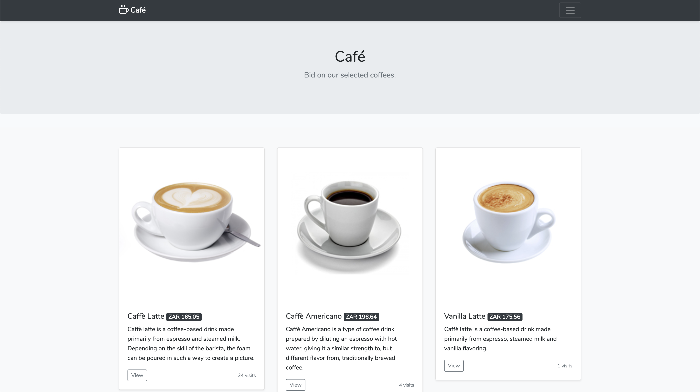
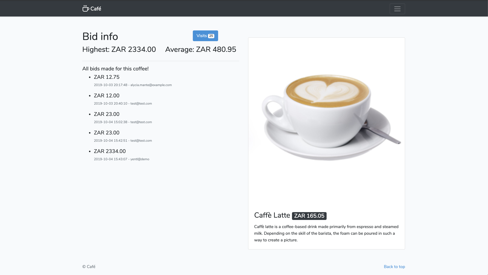
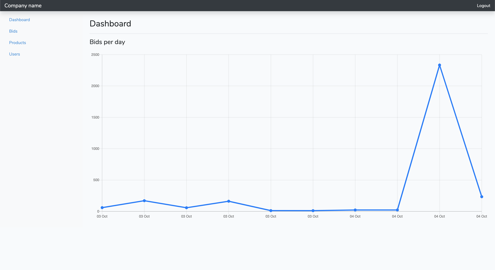
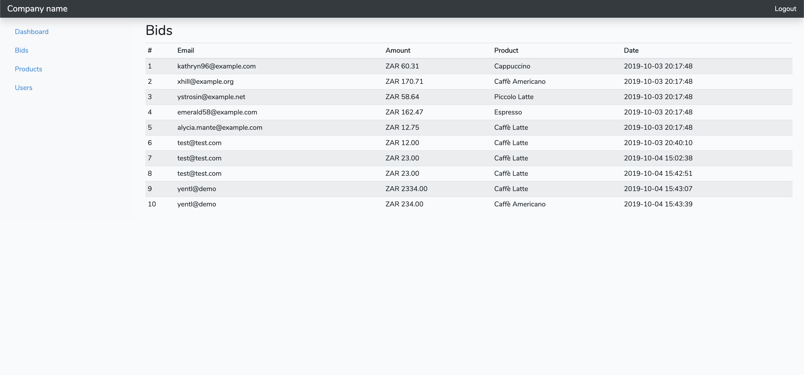

# Café

A simple app for bidding on products.

## Installation

- Clone the repo 

```bash
$ git clone https://github.com/msbodetti/cafe.git
```

- Install dependencies

```bash
Macbook:cafe username$ composer install
Macbook:cafe username$ npm install
```

- Rename `.env.example` to `.env`
- Update database details in `.env`

```php
DB_CONNECTION=mysql
DB_HOST=127.0.0.1
DB_PORT=3306
DB_DATABASE=cafe
DB_USERNAME=root
DB_PASSWORD=
```
- Run migrations

```bash
Macbook:cafe username$ php artisan migrate:fresh --seed
```

- Visit the app in your browser i.e. `http://cafe.test` (Valet)

## Usage

- View the selection of coffee
- Bid on coffee
- View highest/average and your bids
- Login as admin
```bash
Email: admin@cafe.joy
Password: test123
```
- View all bids
- View all users with bid count

## Contributing
Pull requests are welcome. For major changes, please open an issue first to discuss what you would like to change.

Please make sure to update tests as appropriate.

## Screenshots



